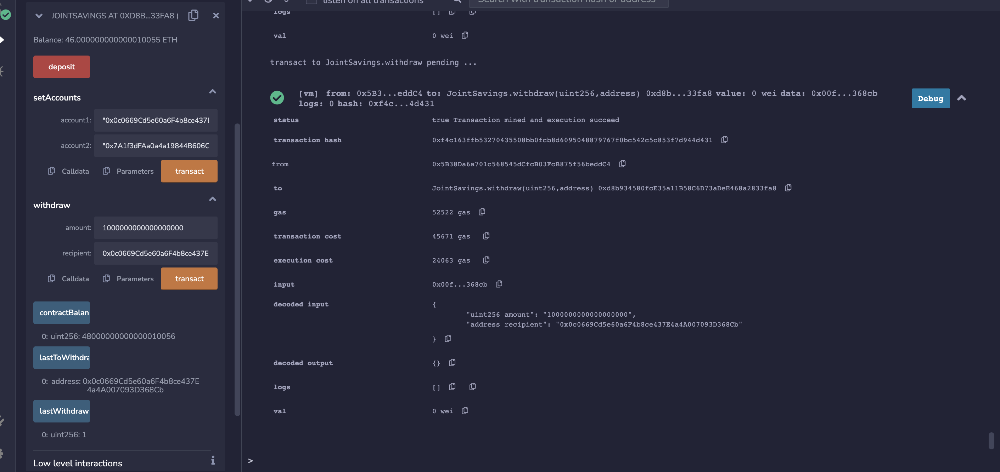
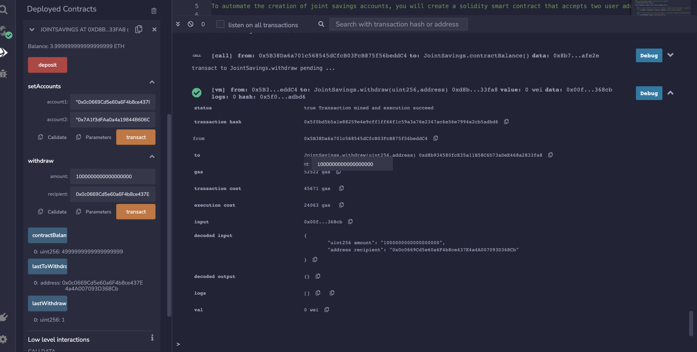
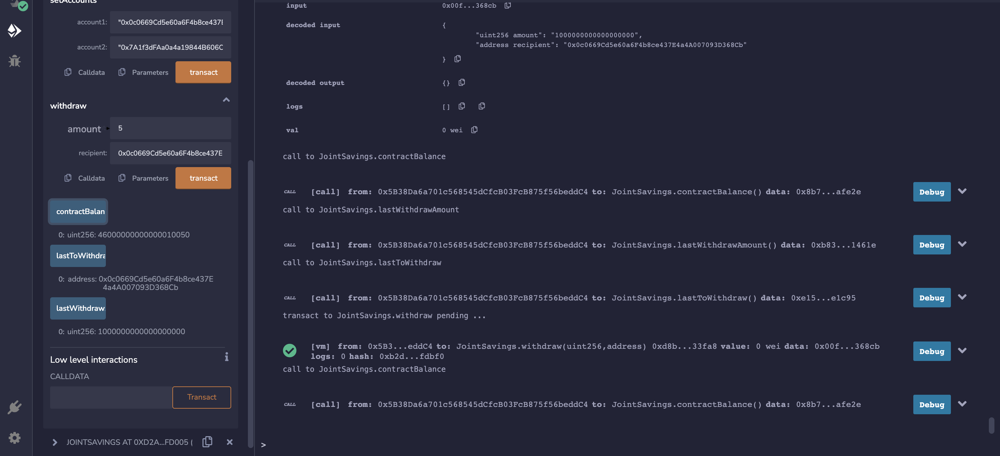
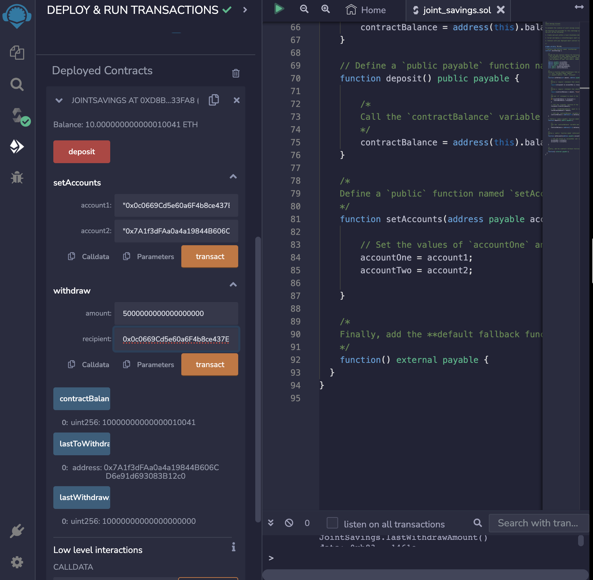
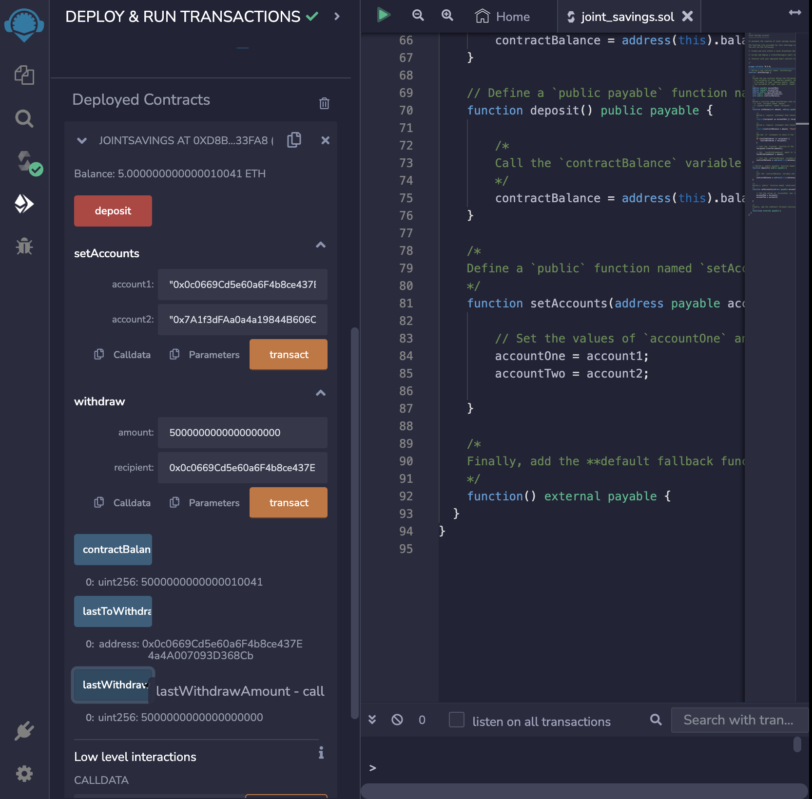
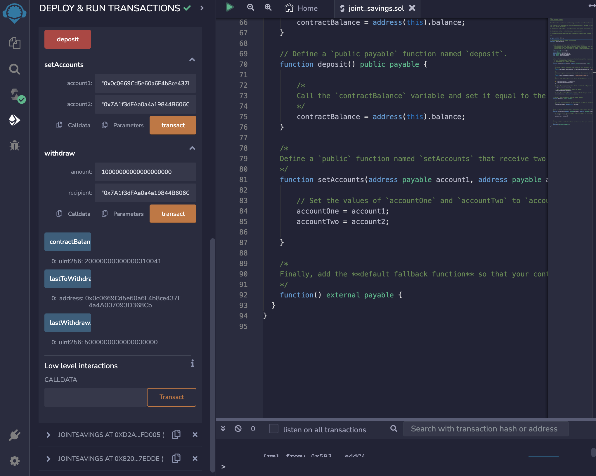
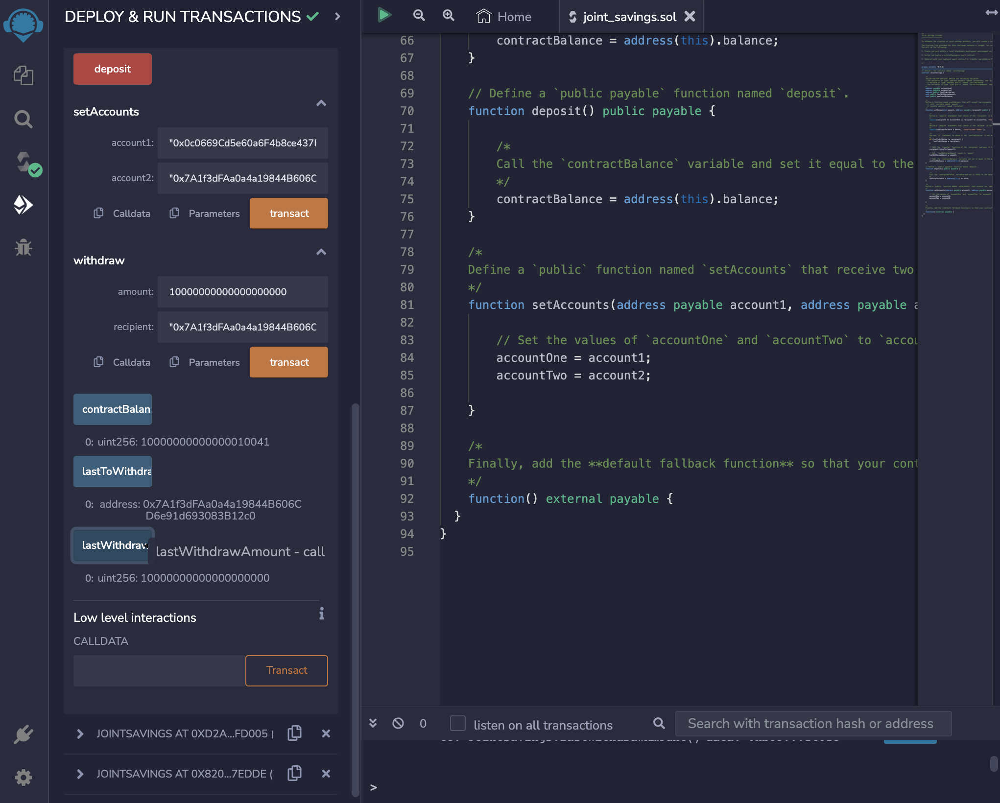

# Unit 20 - "Joint Savings Account"

### Background

A fintech startup company has recently hired you. This company is disrupting the finance industry with its own cross-border, Ethereum-compatible blockchain that connects financial institutions. Currently, the team is building smart contracts to automate many of the institutions’ financial processes and features, such as hosting joint savings accounts.

To automate the creation of joint savings accounts, you’ll create a Solidity smart contract that accepts two user addresses. These addresses will be able to control a joint savings account. Your smart contract will use ether management functions to implement a financial institution’s requirements for providing the features of the joint savings account. These features will consist of the ability to deposit and withdraw funds from the account.

 
 

# Process

After writing the code, I used two dummy accounts to transact various funds. I sent 1 ether as wei, sent 10 ether as wei, and sent 5 ether.

Next, I withdrew 5 ether into account One and 10 ether into account Two. I then used the contractBalance function to check if the funds were successfully withdrawn. Lastly, I used lastWithdrawAmount and lastToWithdraw to make sure that the withdrawed amount and address were accurate. I included all details for the before and after transactions below.

 
 

**Before withdrawing 5 ether**

**After withdrawing 5 ether**

 

**Before withdrawing 10 ether**

After withdrawing 10 ether:

